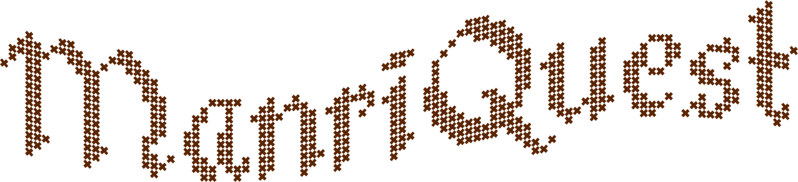
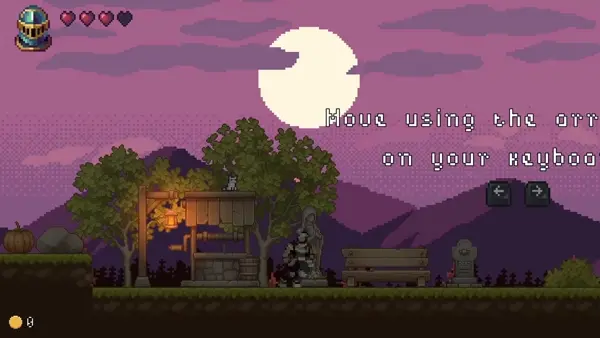

# ManriQuest

**ManriQuest** is a **2D** medieval fantasy **platformer** where you collect coins, dodge deadly traps, and battle your way to a challenging final boss.

  

The game was built using the **Unity** engine and a collection of **royalty-free** resources from the internet.

> [!NOTE]  
This videogame was developed during my time as a student, under a tight deadline and while managing other projects.
It offers the core functionality, but you may encounter bugs, rough edges, and code that’s not production-ready.

## In-Game footage

  
  
  

